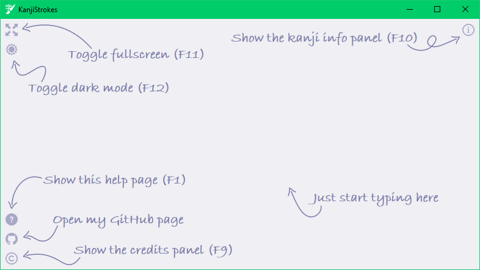
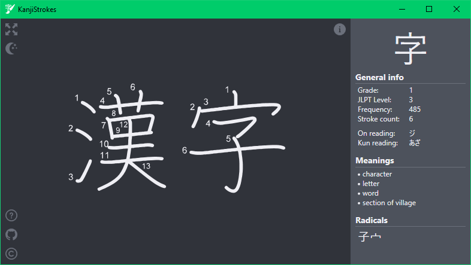

# Kanji Strokes
A small tool to display kanji stroke order, intended for languange learners.

## Features
- Real-time stroke order display while you type
- Automatically switches to hiragana input mode when focused
- Kanji information side panel
  - Chinese and japanese readings
  - List of english meanings
  - List of radicals
  - More information, like grade and JLPT level
- Fullscreen mode
- Light and dark theme

## Download
You can find the latest release [here](https://github.com/AtomCrafty/KanjiStrokes/releases/latest). To run properly, it requires the [.NET Core 3.1 Runtime](https://dotnet.microsoft.com/download/dotnet-core/thank-you/runtime-desktop-3.1.3-windows-x64-installer) to be installed.

## Images

